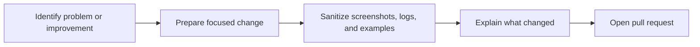

# Contributing

Thanks for helping improve this project.

## Contribution flow

## Before you contribute

Please keep contributions:

- practical
- reproducible
- privacy-conscious
- easy to review

Good contributions include:

- installation improvements
- troubleshooting fixes
- clearer wording
- support for additional safe configurations
- documentation corrections
- Linux and Windows path clarification

## Please do not submit

- private keys
- credentials
- tokens
- sensitive internal IPs or hostnames
- logs containing secrets
- destructive automation without clear warnings

## Preferred contribution style

- keep changes focused
- explain what problem the change solves
- include exact reproduction steps when reporting a bug
- sanitize screenshots and logs before uploading

## Pull request checklist

When opening a pull request, include:

1. what you changed
2. why you changed it
3. how you tested it
4. whether the change affects security or long-running command behavior

## Documentation standards

When adding commands:

- explain what the command is trying to verify
- explain expected output when possible
- warn users before risky or system-changing actions

## Code of conduct

Be respectful and constructive. The goal is to help people build a working setup safely.
