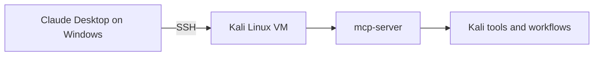
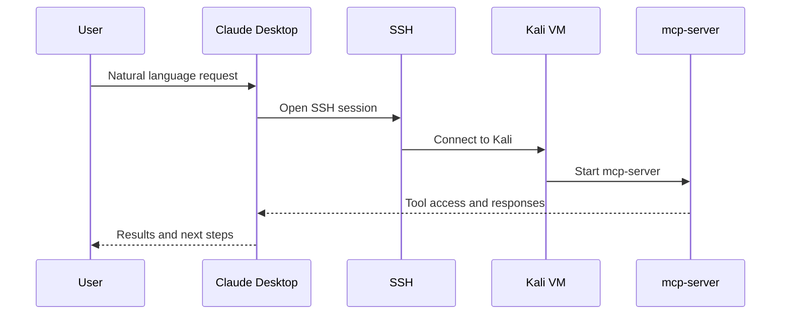

# My Meager Attempt at a Windows-to-Kali MCP Server


A sanitized, documentation-first guide for building a **Windows-to-Kali MCP workflow over SSH** with **Claude Desktop** as the client and **Kali Linux** as the tool host.

## Inspiration

This project was inspired by the official Kali Linux blog post:

**[Kali & LLM: macOS with Claude Desktop GUI & Anthropic Sonnet LLM](https://www.kali.org/blog/kali-llm-claude-desktop/)**

That post focuses on **macOS → Kali** with Claude Desktop. This repository adapts the idea to a **Windows → Kali** setup while keeping the examples sanitized and privacy-safe.

## Architecture



## Flow Overview



## What is in this repository

- `docs/INSTALL.md` — step-by-step setup notes
- `docs/TROUBLESHOOTING.md` — common failure points and checks
- `examples/claude_desktop_config.example.json` — sanitized example config
- `CONTRIBUTING.md` — contribution rules
- `SECURITY.md` — security and disclosure guidance

## Why this repo exists

The Kali article shows the general pattern very well. This repo exists to make the same idea easier to follow for people using:

- Windows instead of macOS
- a local VM or lab setup
- privacy-safe examples instead of real environment details

## Privacy and sanitization

This repo intentionally avoids publishing real personal or environment-specific details.

Do **not** publish:

- private keys
- passwords or tokens
- real usernames you do not want public
- real internal or home IP addresses
- hostnames tied to your environment
- raw logs containing sensitive details

## Included example paths

- `%LOCALAPPDATA%\\Packages\\Claude_pzs8sxrjxfjjc\\LocalCache\\Roaming\\Claude\\claude_desktop_config.json`
- `%APPDATA%\\Claude\\claude_desktop_config.json`

## Quick visual summary

```text
Windows Claude Desktop -> SSH -> Kali VM -> mcp-server -> Kali tools
```

## Notes

- Long-running actions may still require timeout tuning.
- Permissions and network reachability still need to be validated.
- This repo is meant to document a working pattern, not a one-click product.

## License

This repository uses the MIT License.
