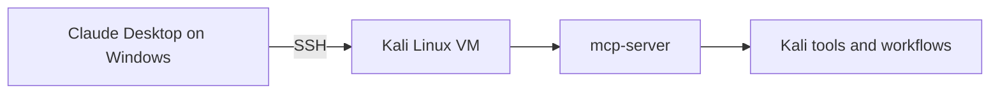
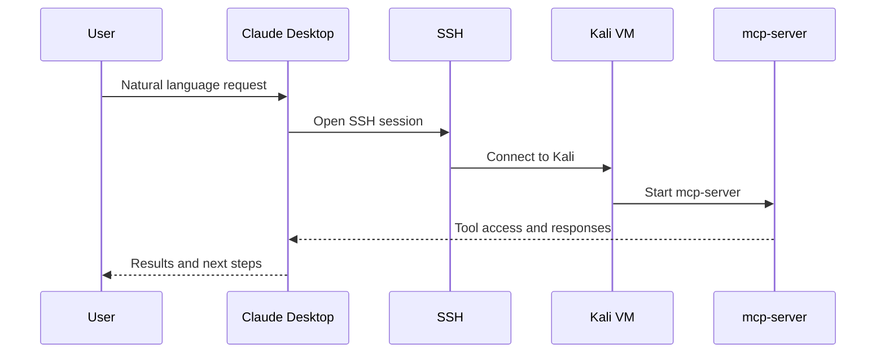

# My Meager Attempt at a Windows-to-Kali MCP Server


A sanitized, documentation-first guide for building a **Windows-to-Kali MCP workflow over SSH** with **Claude Desktop** as the client and **Kali Linux** as the tool host.

## Inspiration

This project was inspired by the official Kali Linux blog post:

**[Kali & LLM: macOS with Claude Desktop GUI & Anthropic Sonnet LLM](https://www.kali.org/blog/kali-llm-claude-desktop/)**

That post focuses on **macOS → Kali** with Claude Desktop. This repository adapts the idea to a **Windows → Kali** setup while keeping the examples sanitized and privacy-safe.

## Architecture



## Flow Overview



## What is in this repository

- `docs/INSTALL.md` — step-by-step setup notes
- `docs/TROUBLESHOOTING.md` — common failure points and checks
- `examples/claude_desktop_config.example.json` — sanitized example config
- `CONTRIBUTING.md` — contribution rules
- `SECURITY.md` — security and disclosure guidance

## Why this repo exists

The Kali article shows the general pattern very well. This repo exists to make the same idea easier to follow for people using:

- Windows instead of macOS
- a local VM or lab setup
- privacy-safe examples instead of real environment details

## What this extension can realistically do

With this setup running, Claude acts like a **natural-language front end for your Kali command line over SSH**.

That means it is best at tasks that are:

- text-based
- command-line driven
- reasonably scoped
- run in authorized environments you control

### Strong use cases

#### 1. Kali administration and health checks

Good for:

- checking whether packages or tools are installed
- verifying service status
- checking interfaces, routes, and IP addresses
- confirming whether `mcp-server` and `kali-server-mcp` are available

#### 2. VM, SSH, and network troubleshooting

Good for:

- debugging Windows-to-Kali SSH problems
- checking host-only vs NAT networking
- reviewing `nmcli`, `ip addr`, and service status output
- identifying misconfigured interfaces or broken reachability

#### 3. Tool inventory and environment checks

Good for:

- listing installed tools
- checking versions
- verifying wordlists or files exist
- confirming listening services and basic environment state

#### 4. Running security tools in an authorized lab

Good for scoped, authorized tasks using tools such as:

- `nmap`
- `nikto`
- `gobuster`
- `dirb`
- `sqlmap`
- `wpscan`
- `john`
- `enum4linux-ng`

Best fit:

- lab enumeration
- service discovery
- web content discovery
- basic validation of lab findings
- password audit work in a controlled environment

#### 5. Summarizing command and scan output

This is one of the best uses.

Good for:

- translating raw tool output into plain English
- pulling out the important findings
- writing remediation bullets
- creating technical or executive summaries

#### 6. Drafting notes and reports

Good for:

- findings sections
- remediation notes
- short assessment summaries
- methodology writeups
- executive-style summaries from CLI output

#### 7. Reviewing scripts, logs, and config files

Good for:

- reading a script and explaining what it does
- checking logs for failure points
- spotting likely misconfigurations
- finding timeout values and command runner limits

#### 8. Repeating small lab workflows

Good for repeatable sequences such as:

- check connectivity
- run a tool
- collect output
- summarize the result
- suggest the next troubleshooting step

### Things it can do, but less reliably

#### 9. Longer scans

Possible, but success depends on:

- timeout settings
- network quality
- permissions
- whether the command waits for input
- how much output is produced

#### 10. Multi-step lab workflows

Possible for smaller chains of tasks, but the more steps involved, the more fragile the workflow becomes.

It is usually better to ask it to:

- do one stage
- summarize the output
- then move to the next stage

instead of expecting perfect end-to-end autonomy.

## What it is not great at

This setup is **not** best suited for:

- GUI-heavy work
- browser clicking workflows
- CAPTCHA or visual app interaction
- full desktop automation
- very interactive terminal programs
- extremely long-running noisy jobs

In other words, this is primarily a **CLI + SSH + Kali tools** workflow, not a full remote desktop bot.

## Quick visual summary

```text
Windows Claude Desktop -> SSH -> Kali VM -> mcp-server -> Kali tools
```

## Privacy and sanitization

This repo intentionally avoids publishing real personal or environment-specific details.

Do **not** publish:

- private keys
- passwords or tokens
- real usernames you do not want public
- real internal or home IP addresses
- hostnames tied to your environment
- raw logs containing sensitive details

## Included example paths

- `%LOCALAPPDATA%\\Packages\\Claude_pzs8sxrjxfjjc\\LocalCache\\Roaming\\Claude\\claude_desktop_config.json`
- `%APPDATA%\\Claude\\claude_desktop_config.json`

## Notes

- Long-running actions may still require timeout tuning.
- Permissions and network reachability still need to be validated.
- This repo is meant to document a working pattern, not a one-click product.

## License

This repository uses the MIT License.
