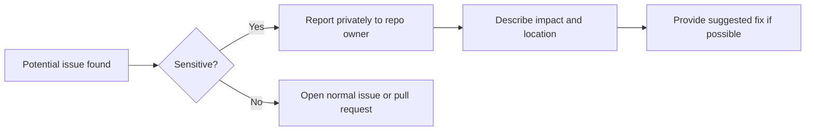

# Security Policy

This repository is mostly documentation and example configuration, so the most likely security issues involve **exposed secrets**, **unsafe examples**, or **sensitive environment details accidentally committed**.

## Reporting flow

## Supported content

Security issues are most likely to involve:

- exposed credentials
- unsafe example commands
- insecure SSH recommendations
- sensitive data accidentally committed

## Reporting a vulnerability

Please do **not** open a public issue for sensitive security problems.

Instead, report the issue privately to the repository owner by direct contact if available.

Include:

- a short description of the issue
- where it appears
- potential impact
- any suggested fix

## What not to report publicly

Do not post:

- private keys
- usernames tied to live systems
- internal IPs
- environment dumps
- copied config files containing secrets

## Security best practices for contributors

- use example placeholders
- sanitize all logs
- avoid publishing live infrastructure details
- prefer least-privilege guidance
- do not recommend disabling security controls unless clearly explained and temporary
