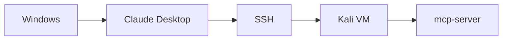

# Installation Guide


This guide shows one practical way to connect **Claude Desktop on Windows** to a **Kali MCP server over SSH**.

## Setup flow



## 1. Confirm SSH works from Windows to Kali

### What this check does

This command verifies that Windows can reach the Kali VM, authenticate, and run a simple remote command.

```powershell
ssh user@KALI-IP "echo OK"
```

Expected output:

```text
OK
```

If this fails, fix SSH or networking first.

## 2. Verify that `mcp-server` exists on Kali

### What this check does

This command confirms that the MCP server executable is installed and available in the Kali PATH.

```powershell
ssh user@KALI-IP "which mcp-server"
```

Expected output might look like:

```text
/usr/bin/mcp-server
```

## 3. Locate the Claude Desktop config file on Windows

Depending on how Claude Desktop was installed, check one of these paths.

### Microsoft Store installation

```text
%LOCALAPPDATA%\Packages\Claude_pzs8sxrjxfjjc\LocalCache\Roaming\Claude\claude_desktop_config.json
```

### Standard installation

```text
%APPDATA%\Claude\claude_desktop_config.json
```

## 4. Add an MCP server entry

Use the sanitized example from `examples/claude_desktop_config.example.json` and adapt it to your own environment.

Important:

- replace the SSH key path
- replace the username
- replace the Kali IP
- never commit private keys or real secrets

## 5. Restart Claude Desktop fully

### What this step verifies

This makes sure Claude reloads the config from disk instead of using cached settings.

- close Claude completely
- reopen the application
- test a small request before trying anything longer

## 6. Test a minimal remote workflow

### What this verifies

You are checking that:

- the JSON config is valid
- SSH launches correctly
- Claude can start the remote process
- the server responds without timing out immediately

## 7. Move to longer actions only after basic success

If short checks work but longer actions fail, review:

- timeout settings
- sudo or permission issues
- network reachability to targets
- command execution limits in the wrapper
- commands that may be waiting on interactive prompts

## Optional Kali checks

### Show IP addresses

```bash
ip addr
```

### Show network devices

```bash
nmcli device status
```

### Show configured connections

```bash
nmcli connection show
```

### Check NetworkManager

```bash
systemctl status NetworkManager
```

## Privacy reminder

Keep examples sanitized. Use placeholders such as `user`, `KALI-IP`, and non-sensitive paths whenever publishing documentation.
