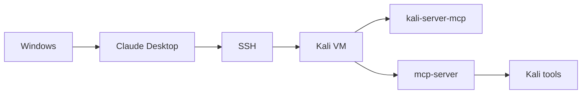

# Installation Guide


This guide adapts the flow from the official Kali Linux blog post about **macOS → Kali with Claude Desktop** into a **Windows → Kali** setup.

Source of inspiration:

- [Kali & LLM: macOS with Claude Desktop GUI & Anthropic Sonnet LLM](https://www.kali.org/blog/kali-llm-claude-desktop/)

The official Kali post uses **macOS as the GUI client** and notes that **Microsoft Windows can also be used, but is not covered there**. This document fills in the Windows side with a privacy-safe, step-by-step approach.

## End-to-end setup flow



## Overview of what you are building

You are connecting three pieces together:

1. **Windows** as the desktop client
2. **Kali Linux** as the VM/tool host
3. **Claude Desktop** as the MCP client that reaches Kali over SSH

At a high level:

- Windows runs Claude Desktop
- Claude Desktop launches `ssh`
- SSH connects to Kali
- Kali runs `mcp-server`
- `mcp-server` talks to `kali-server-mcp`
- Kali tools become available through the MCP workflow

---

## Part 1 - Prepare the Kali VM

### Step 1. Install or update Kali

Start with a working Kali VM. A minimal install is fine, but it will usually be missing many tools.

Before moving on, confirm:

- the VM boots correctly
- you can log in locally
- the VM has network connectivity

### Step 2. Find the Kali IP address

### What this checks

This tells you the IP address Windows will use to reach Kali over SSH.

Run on Kali:

```bash
ip addr
```

Look for the active interface and note the current IP address.

Use a placeholder like `KALI-IP` in documentation. Do not publish your real internal IP if you want to keep your lab private.

### Step 3. Install and start SSH on Kali

This follows the same starting point as the official Kali blog.

### What this does

These commands install the SSH server and make sure it starts now and on future boots.

Run on Kali:

```bash
sudo apt update
sudo apt install -y openssh-server
sudo systemctl enable --now ssh
```

### Step 4. Verify the SSH service is running

### What this checks

This confirms that Kali is actively listening for SSH connections.

Run on Kali:

```bash
systemctl status ssh
```

You want to see that the service is active.

### Step 4A. Optional: reduce SSH login noise for MCP sessions

### What this does

MCP over SSH works best when the remote side is quiet and does not emit extra banner text.

Optional hardening in `/etc/ssh/sshd_config`:

```text
PrintMotd no
PrintLastLog no
```

After editing the SSH config, reload or restart SSH:

```bash
sudo systemctl restart ssh
```

### Step 5. Optional but helpful: install common networking utilities

### What this does

These are not required for SSH itself, but they make troubleshooting easier.

Run on Kali:

```bash
sudo apt install -y net-tools iproute2 network-manager
```

### Step 5A. If `dhclient` is missing on a minimal install

Some minimal Kali installs may not include `dhclient` or may not bring an interface up the way you expect.

### What this does

These commands bring the interface up manually and let you assign an address directly if needed.

Bring the interface up:

```bash
sudo ip link set eth0 up
```

Assign a temporary address manually if needed:

```bash
sudo ip addr add 192.168.56.101/24 dev eth0
```

Replace:

- `eth0` with the actual device name if different
- `192.168.56.101/24` with the address appropriate for your host-only subnet

### Step 6. Check that Kali networking is stable

### What this checks

This confirms the interface is up, managed, and has the expected address.

Run on Kali:

```bash
nmcli device status
nmcli connection show
ip addr
```

If the interface is not being managed correctly, fix that before continuing.

---

## Part 1A - Configure the VM network on the Windows host

For most lab setups, the easiest pattern is to give the VM **two adapters**:

- **Adapter 1: NAT** for Internet access from Kali
- **Adapter 2: Host-only** so Windows can always reach Kali directly over a private lab network

That gives you a stable management path from Windows to Kali without depending on your home router, while still letting Kali install packages and updates through NAT.

### Option A - VirtualBox host-only setup

VirtualBox includes **Host-Only Networks** in its Network Manager.

#### Step 6A-1. Create or verify a host-only network in VirtualBox

On the Windows host:

1. Open **VirtualBox**
2. Go to **Tools** → **Network**
3. Open the **Host-Only Networks** tab
4. Create a host-only network if one does not already exist
5. Verify that the host-only network has an IPv4 range you want to use for your lab

A common private example is:

- host-only network: `192.168.56.0/24`
- Windows host adapter: `192.168.56.1`
- Kali guest: `192.168.56.101`

Use your own values if you prefer.

#### Step 6A-2. Attach the Kali VM to NAT and Host-only

In the Kali VM settings:

1. Open **Settings** → **Network**
2. Set **Adapter 1** to **NAT**
3. Enable **Adapter 2**
4. Set **Adapter 2** to **Host-Only Network** or **Host-Only Adapter**, depending on the version shown in your UI
5. Select the host-only network you created earlier

#### Step 6A-3. Boot Kali and check both interfaces

Run on Kali:

```bash
ip addr
```

You should normally see:

- one interface with a NAT-side address
- one interface with a host-only address in your private lab range

### Option B - VMware Workstation host-only setup

In VMware Workstation, the host-only network is commonly **VMnet1**, while NAT is commonly **VMnet8**.

#### Step 6B-1. Open VMware virtual network settings

On the Windows host:

1. Open **VMware Workstation**
2. Open the **Virtual Network Editor**
3. Verify that a **Host-only** network exists
4. Verify the subnet you want to use for the host-only network

A common example is:

- **VMnet1** = host-only
- **VMnet8** = NAT

#### Step 6B-2. Attach the Kali VM to NAT and Host-only

In the Kali VM settings:

1. Open **Edit virtual machine settings**
2. Add or verify one network adapter set to **NAT**
3. Add a second network adapter set to **Host-only**
4. Save the VM settings

#### Step 6B-3. Boot Kali and check both interfaces

Run on Kali:

```bash
ip addr
```

You should normally see:

- one interface for NAT
- one interface for the host-only subnet

### Step 6C. Make the host-only side predictable

If you want a stable SSH target, it is often easier to use a fixed address on the host-only interface inside Kali.

First check whether NetworkManager is actually managing the interface:

```bash
nmcli device status
```

If the interface shows as `unmanaged`, fix that first:

```bash
sudo nmcli device set eth0 managed yes
```

Then confirm the interface is now managed and identify the connection name:

```bash
nmcli device status
nmcli connection show
```

Once the interface is managed, set a static address such as:

```bash
sudo nmcli connection modify "HOSTONLY-CONNECTION" ipv4.addresses 192.168.56.101/24 ipv4.method manual
sudo nmcli connection up "HOSTONLY-CONNECTION"
```

Replace:

- `eth0` with the real device name if different
- `HOSTONLY-CONNECTION` with the real connection name
- `192.168.56.101/24` with the address you want to use

### Step 6D. Verify Windows can reach Kali on the host-only address

From Windows PowerShell:

```powershell
ssh kali@KALI-IP "echo OK"
```

If you are using the host-only address as your SSH target, `KALI-IP` should be the host-only IP, not the NAT-side IP.

---

## Part 2 - Create SSH key-based access from Windows to Kali

### Step 7. Open PowerShell on Windows

Use either:

- Windows PowerShell
- PowerShell 7
- Windows Terminal with a PowerShell profile

### Step 8. Check whether you already have an SSH key

### What this checks

This tells you whether a key pair already exists in your Windows profile.

Run on Windows:

```powershell
Get-ChildItem $HOME\.ssh
```

If you already have an `id_ed25519` key pair you want to use, you can keep it. Otherwise generate a new one.

### Step 9. Generate a new SSH key on Windows if needed

### What this does

This creates a private key and public key for SSH authentication.

Run on Windows:

```powershell
ssh-keygen -t ed25519
```

Accept the default path unless you have a reason to change it.

The default key path will normally be:

```text
C:\Users\YOUR-USER\.ssh\id_ed25519
```

Do **not** publish the real contents of your private key.

### Step 10. Copy the public key to Kali

### What this does

This allows Windows to authenticate to Kali using the SSH key instead of typing the Kali password every time.

#### Option A - Use `ssh-copy-id` if you have it available

```powershell
ssh-copy-id kali@KALI-IP
```

#### Option B - Manual method from Windows

First display your public key:

```powershell
Get-Content $HOME\.ssh\id_ed25519.pub
```

Then, on Kali, append that public key into:

```text
~/.ssh/authorized_keys
```

Make sure the permissions are correct on Kali:

```bash
mkdir -p ~/.ssh
chmod 700 ~/.ssh
chmod 600 ~/.ssh/authorized_keys
```

### Step 11. Test SSH from Windows to Kali

### What this checks

This confirms that Windows can log in to Kali and run a simple remote command.

Run on Windows:

```powershell
ssh kali@KALI-IP "echo OK"
```

Expected output:

```text
OK
```

If this fails, do not move on yet. Fix SSH first.

---

## Part 3 - Install the Kali MCP components

### Step 12. Install the Kali MCP server package

This follows the same package used in the Kali blog post.

### What this does

This installs the Kali-side server components used by the MCP workflow.

Run on Kali:

```bash
sudo apt update
sudo apt install -y mcp-kali-server
```

### Step 13. Start the Kali API server

### What this does

This starts the Kali API service that `mcp-server` will connect to locally.

Run on Kali:

```bash
kali-server-mcp
```

You should leave this running while testing.

The service normally binds to localhost and logs that it has started.

### Step 13A. Optional: keep `kali-server-mcp` alive across reboots with systemd

If you do not want to start `kali-server-mcp` manually every time, create a simple systemd service.

Example unit file:

```ini
[Unit]
Description=Kali MCP API Server
After=network.target

[Service]
Type=simple
ExecStart=/usr/bin/kali-server-mcp
Restart=on-failure

[Install]
WantedBy=multi-user.target
```

Save it as:

```text
/etc/systemd/system/kali-server-mcp.service
```

Then enable and start it:

```bash
sudo systemctl daemon-reload
sudo systemctl enable --now kali-server-mcp
sudo systemctl status kali-server-mcp
```

### Step 14. In a second Kali terminal, test the MCP server client

### What this checks

This verifies that `mcp-server` can connect to the local Kali API service.

Run on Kali in another terminal:

```bash
mcp-server
```

If the connection is healthy, you should see that it connected successfully to the Kali API server.

### Step 15. Install the tools that the Kali MCP workflow expects

The official Kali post shows that a minimal Kali install may be missing many tools. This step addresses that directly.

### What this does

This installs the MCP package again along with a practical set of supported security tools and wordlists.

Run on Kali:

```bash
sudo apt install -y mcp-kali-server dirb gobuster nikto nmap enum4linux-ng hydra john metasploit-framework sqlmap wpscan wordlists
```

### Step 16. Expand the RockYou wordlist if you plan to use it

### What this does

Some workflows expect the file to be uncompressed and ready to use.

Run on Kali:

```bash
sudo gunzip -v /usr/share/wordlists/rockyou.txt.gz
```

### Step 17. Re-test `mcp-server`

### What this checks

This confirms that the Kali API server is reachable and that the server can see the installed tools.

Run on Kali:

```bash
mcp-server
```

If you still see warnings about missing tools, install the missing packages before continuing.

---

## Part 4 - Install and configure Claude Desktop on Windows

### Step 18. Install Claude Desktop on Windows

Install Claude Desktop normally on Windows and sign in.

After installation, open the app once so its config path is created.

### Step 19. Find the Claude Desktop config path on Windows

Depending on how Claude Desktop was installed, check one of these:

#### Microsoft Store installation

```text
%LOCALAPPDATA%\Packages\Claude_pzs8sxrjxfjjc\LocalCache\Roaming\Claude\claude_desktop_config.json
```

#### Standard installation

```text
%APPDATA%\Claude\claude_desktop_config.json
```

### Step 20. Edit `claude_desktop_config.json`

### What this does

This tells Claude Desktop how to launch the remote MCP server through SSH.

Use the sanitized example in this repository:

- `examples/claude_desktop_config.example.json`

Example structure:

```json
{
  "mcpServers": {
    "mcp-kali-server": {
      "transport": "stdio",
      "command": "ssh",
      "args": [
        "-i",
        "C:\\Users\\YOUR-USER\\.ssh\\id_ed25519",
        "-o",
        "StrictHostKeyChecking=no",
        "-o",
        "BatchMode=yes",
        "YOUR-KALI-USER@KALI-IP",
        "mcp-server"
      ]
    }
  }
}
```

Replace only the placeholders:

- `YOUR-USER`
- `YOUR-KALI-USER`
- `KALI-IP`

Do **not** publish your real username, private key path, or environment values in the repository.

### Step 21. Restart Claude Desktop fully

### What this checks

This makes sure Claude reloads the MCP config from disk.

Do a full close and reopen, not just a window minimize.

---

## Part 5 - Test the complete workflow

### Step 22. Keep `kali-server-mcp` running on Kali

You need the Kali API server available while Claude tries to connect.

### Step 23. Make a simple request in Claude Desktop

Start with something small and low risk.

Examples:

- ask Claude to verify whether a tool exists
- ask Claude to perform a simple check that does not require a long runtime

The point of the first test is to verify the end-to-end path, not to stress the setup.

### Step 24. If short actions work, move to longer ones carefully

If longer actions fail while short ones work, review:

- timeout settings
- permissions
- target reachability
- commands waiting for interactive input

---

## Useful verification commands

### On Kali

```bash
which mcp-server
which kali-server-mcp
systemctl status ssh
systemctl status kali-server-mcp
ip addr
nmcli device status
nmcli connection show
```

### On Windows

```powershell
ssh kali@KALI-IP "echo OK"
ssh -i C:\Users\YOUR-USER\.ssh\id_ed25519 kali@KALI-IP "which mcp-server"
```

---

## Privacy reminder

Keep examples sanitized.

Use placeholders such as:

- `YOUR-USER`
- `YOUR-KALI-USER`
- `KALI-IP`

Never upload:

- private keys
- passwords
- tokens
- real internal IPs
- raw logs containing personal or environment-specific information
