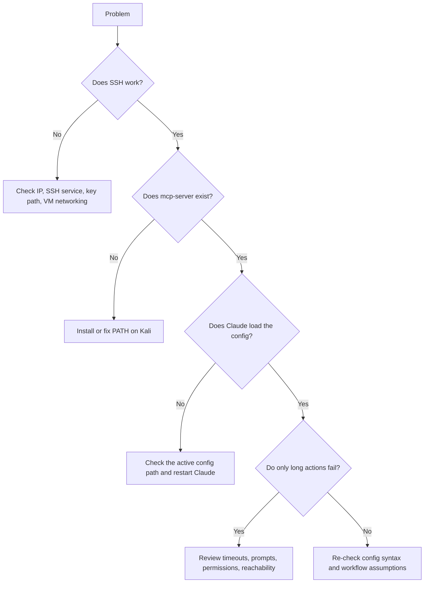

# Troubleshooting


This page covers the failure points most likely to break a **Windows-to-Kali MCP setup**.

## Triage flow



## Claude Desktop ignores config changes

### Possible cause

Claude Desktop may be reading the Microsoft Store sandboxed config path instead of the roaming profile path.

### Check

```text
%LOCALAPPDATA%\Packages\Claude_pzs8sxrjxfjjc\LocalCache\Roaming\Claude\claude_desktop_config.json
```

```text
%APPDATA%\Claude\claude_desktop_config.json
```

### Fix

- edit the active file
- save it
- fully restart Claude Desktop

## SSH from Windows to Kali fails

### Checks

```bash
ip addr
```

```powershell
ssh user@KALI-IP "echo OK"
```

### Things to verify

- Kali is powered on
- the SSH service is installed and running
- the VM network mode is working
- the private key path is correct
- the target IP is the current one, not an old cached value

## Network interface issues in Kali

### Checks

```bash
nmcli device status
nmcli connection show
```

### Possible fixes

- review `/etc/network/interfaces`
- review `/etc/NetworkManager/NetworkManager.conf`
- remove conflicting old connections
- enable autoconnect for the correct connection
- restart NetworkManager

```bash
systemctl restart NetworkManager
```

## Short tasks work but longer actions fail

### Possible cause

A timeout may be enforced in the server wrapper or command runner.

### Things to review

- timeout values in the server-side code
- network reachability
- permissions
- commands waiting on interactive prompts
- workflows that require elevated privileges

## Recommended order

1. Verify the Kali IP
2. Verify SSH from Windows
3. Verify `mcp-server` exists
4. Verify the Claude config path
5. Restart Claude Desktop fully
6. Test a simple remote command first
7. Only then test longer actions

## Privacy reminder

Do not paste real usernames, real IP addresses, key filenames, or raw environment logs into public troubleshooting notes.
